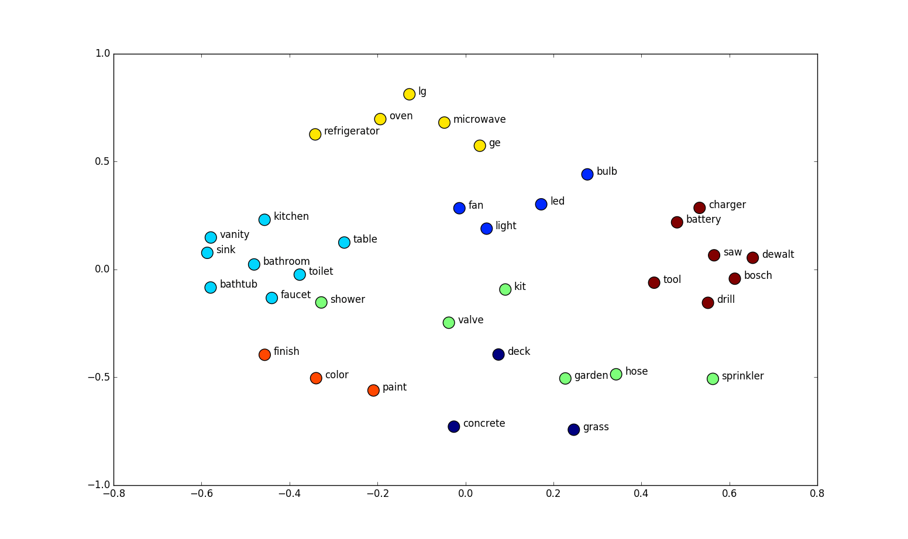

# Классификация документов: 7 практических подходов для небольших наборов данных.

Классификация документов или текста — это одна из важнейших задач в обработке естественного языка (natural language processing, NLP).
У нее есть множество применений, таких как классификация новостей, фильтрация спама, поиск неприемлемых комментариев и т. д.

У больших компаний нет проблем с со сбором больших наборов данных, поэтому обучение модели классификации текста с нуля — вполне осуществимая задача.
Однако, для большинства реальных задач большие наборы данных — редкость, и для построения своей модели приходится проявлять смекалку.

В этой статье я расскажу о практических подходах к преобразованиям текста, которые сделают возможной классификацию документов даже если набор данных небольшой.

## Введение в классификацию документов

Процесс классификации документов начинается с очистки и подготовки корпуса.
Затем этот корпус кодируется любым типом представления текста, после чего можно приступить к моделированию.


В этой статье мы сосредоточимся на шаге «Представление текста» из этой диаграммы.

## Тестовый набор данных для классификации

Мы будем использовать данные из соревнования [Правда, или нет? NLP с твитами о катастрофах](https://www.kaggle.com/c/nlp-getting-started) на Kaggle.
Задача — предсказать какие твиты были о настоящих катастрофах, а какие — нет.

Если вы хотите шаг за шагом повторять статью, то не забудьте установить библиотеки, использовавшиеся в ней.

Давайте взглянем на наши данные:

```python
import pandas as pd

tweet= pd.read_csv('../input/nlp-getting-started/train.csv')
test=pd.read_csv('../input/nlp-getting-started/test.csv')

tweet.head(3)
```


В данных содержится идентификатор, ключевое слово, местоположение, текст и бинарное целевое значение.
Для предсказания результата мы будем использовать только текст твита.

```python
print('There are {} rows and {} columns in train'.format(tweet.shape[0],tweet.shape[1]))
print('There are {} rows and {} columns in test'.format(test.shape[0],test.shape[1]))
```

В обучающей выборке меньше 8000 твитов.
Эта выборка маленькая и сложная для работы, особенно если учесть ограничение в 280 символов.

## Подготовка текстовых данных

Прежде, чем мы приступим к решению задач NLP, нужно предварительно обработать и очистить данные.
Цель статьи не в этом, но, если вам интересно, можете почитать подробнее об этом шаге в [этой статье](https://towardsdatascience.com/nlp-for-beginners-cleaning-preprocessing-text-data-ae8e306bef0f).

Если коротко, то мы:

* **Токенизируем** — переводим предложения в список токенов или слов.
* **Избавляемся от стоп-слов** — выкидываем слова вроде «a» или «the».
* **Лемматизируем** — приводим слова к их нормальной форме или корню («studies», «studing» → «study»).

```python
def preprocess_news(df):
    '''Function to preprocess and create corpus'''
    new_corpus=[]

    lem=WordNetLemmatizer()
    for text in df["question_text"]:
        words=[w for w in word_tokenize(text) if (w not in stop)]

        words=[lem.lemmatize(w) for w in words]

        new_corpus.append(words)
    return new_corpus

corpus=preprocess_news(df)
```

Теперь давайте посмотрим, как можно представить этот корпус, чтобы его можно было передать в алгоритм машинного обучения.

## Представление текста

Текст нельзя напрямую подать на вход модели машинного обучения, его надо сначала перевести в цифровой формат.
Этот шаг называют представлением текста.

### CountVectorizer

CountVectorizer — это простой способ векторизовать и представлять текстовые документы.
Он токенизирует входные данные и строит словарь известных слов, а затем представяет документ используя этот словарь.

Давайте разберем на примере:

```python
text = ["She sells seashells in the seashore"]
# create the transform
vectorizer = CountVectorizer()
# tokenize and build vocab
vectorizer.fit(text)
# summarize
print(vectorizer.vocabulary_)
# encode document
vector = vectorizer.transform(text)
# summarize encoded vector
print(vector.shape)
print(type(vector))
print(vector.toarray())
```


Как вы заметили, CountVectorizer построил словарь из переданного текста и представил слова с помощью библиотеки [Numpy](https://numpy.org/), позволяющей создавать разреженные матрицы.
Попробуем преобразовать другой текст используя этот словарь и посмотреть на вывод, чтобы лучше понять работу алгоритма.

```python
vector=vectorizer.transform(["I sell seashells in the seashore"])
vector.toarray()
```


Вы можете заметить, что:

* Нули на позициях 3 и 4 означают, что эти слова не представлены в нашем словаре. На других позициях стоят единицы, то есть соответствующие слова были найдены.
Слова, которые отсутствуют в словаре — это «sells» и «she». 
Теперь когда мы разобрались в работе CountVectorizer, можно использовать его для преобразования нашего корпуса.

```python
vec=CountVectorizer(max_df=10,max_features=10000)
vec.fit(df.question_text.values)
vector=vec.transform(df.question_text.values)
```

Следует знать, что у CountVectorizer есть несколько важных параметров, которые нужно подбирать в зависимости от задачи:

* **max_features** — построенный словарь будет содержать только n самых часто встречающихся в корпусе токенов, отсортированных по частоте.
* **min_df** — при построении словаря будут игнорироваться слова из текстов, частота которых строго ниже заданного порогового значения.
* **max_df** —  при построении словаря будут игнорироваться слова из текстов, частота которых строго выше заданного порогового значения.

Разведочный анализ данных обычно помогает в выборе подходящих параметров (или диапазонов для методов оптимизации гиперпараметров).

### TfidfVectorizer

Одна из проблем при работе с Countvectorizer заключается в том, что частые слова, такие как "the" будут встречаться оряться много раз (если вы не удалили их на этапе предобработки) и эти слова на самом деле не очень важны.
Одна из популярных альтернатив — TfidfVectorizer.
Его название — это акроним от **Term frequency-inverse document frequency** (частота слова — обратная частота документа).

* **Частота слова (Term Frequency)** — подсчитывает, как часто выбранное слово появляется в документе. 
* **Обратная частота документа (Inverse Document Frequency)** — снижает вес слов, которые часто встречаются в документах.

Давайте взглянем на пример:

```python
from sklearn.feature_extraction.text import TfidfVectorizer
# list of text documents
text = ["She sells seashells by the seashore","The sea.","The seashore"]
# create the transform
vectorizer = TfidfVectorizer()
# tokenize and build vocab
vectorizer.fit(text)
# summarize
print(vectorizer.vocabulary_)
print(vectorizer.idf_)
# encode document
vector = vectorizer.transform([text[0]])
# summarize encoded vector
print(vector.shape)
print(vector.toarray())
```


В словаре снова 6 слов и обратная частота документа рассчитана для каждого из них, устанавливая самый низкий вес для слова «the», которое встретилось 4 раза.

Затем веса нормализуются до диапазона между 0 и 1, и это текстовое представление уже может быть подано в какую-либо модель машинного обучения.

### Word2vec

Большая проблема в рассмотренных подходах заключается в том, что представление теряет контекст слова.
Вложения (embeddings) слов позволяют создать намного лучшие представления путем кодирования контекстной информации.
Они представляют собой **отображения слов в соответствующие n-мерные векторы**.



Word2Vec был разработан в Google Томасом Миколовым с коллегами и использует **неглубокую нейронную сеть** для построения вложений слов.
Векторы получаются из контекста, в котором фигурирует слово.
А именно, метод смотрит на слова, которые встречаются совместно.

Ниже приведена матрица совместного вхождения для предложения «The cat sat on the mat».


Word2vec состоит из двух различных моделей:

* **Непрерывный мешок слов** (Continuous Bag of Words, CBoW) можно рассматривать вложения слов, полученных обучением модели, **предсказывающей слова по контексту**.
* **Skip-Gram** же наоборот, получает вложения слов обучая модель **предсказывать контекст по слову**.

Основная идея вложения слов в том, что слова, появляющиеся в схожем контексте, будут ближе в векторном пространстве. Давайте реализуем word2vec на языке python:

```python
import gensim
from gensim.models import Word2Vec

model = gensim.models.Word2Vec(corpus, 
                               min_count = 1, size = 100, window = 5)
```

Итак, вы создали свою модель word2vec.
Вы можете поэкспериментировать со следующими важными параметрами:

* **size** — определяет размеры вложениий для результирующих векторов слов.
* **min_count** — при построении словаря игнорировать слова с частотой документа ниже заданного порога.
* **window** — количество слов рядом с рассматриваемым, которые используются при построении представления. Эту величину ещё называют размер окна.

В этой статье мы сфокусируемся на практических подходах для небольших наоборов данных и будем использовать предварительно обученные векторы слов вместо обучения на основе нашего корпуса.
Этот метод обеспечит лучшее качество.

Сначала вам надо скачать обученные векторы [отсюда](https://github.com/mmihaltz/word2vec-GoogleNews-vectors).
Затем вы можете загрузить векторы, используя библиотеку gensim.

```python
from  gensim.models.KeyedVectors import load_word2vec_format

def load_word2vec():
    word2vecDict = load_word2vec_format(
        '../input/word2vec-google/GoogleNews-vectors-negative300.bin',
        binary=True, unicode_errors='ignore')
    embeddings_index = dict()
    for word in word2vecDict.wv.vocab:
        embeddings_index[word] = word2vecDict.word_vec(word)

    return embeddings_index
```

Давайте посмотрим на вложение:

```python
w2v_model=load_word2vec()
w2v_model['London'].shape
```


Как вы видите, слово представлено 300-мерным вектором.
Каждое слово из корпуса может быть представлено в таком виде, и получившуюся матрицу вложений можно использовать для обучения модели.

### FastText

Теперь давайте рассмотрим чрезвычайно полезный модуль из genism — FastText.
Он был разработан в Facebook и обеспечивает отличное качество и скорость в задачах классификации текста.

Он поддерживает модели Continuous Bag of Words и Skip-Gram. 
Главное различие между предыдщими моделями и FastText в том, что он **разбивает слова на несколько n-грамм**.

Возьмем, к примеру, слово «orange».

Триграммами этого слова будут «ora», «ran», «ang», «nge» (игнорируя начальную и конечную границы слова).

**Вектор вложения слова (текстовое представление) для «orange» будет суммой этих n-грамм**.
Редко встречающиеся слова или опечатки теперь могут быть правильно представлены, так как с высокой вероятностью некоторые из их n-грамм встречаются и в других слова.

К примеру, для слова «stupedofantabulouslyfantastic», которое, возможно, никогда не встречалось ни в одном корпусе, genism может вернуть или нулевой вектор, или случайный вектор небольшой длины.

FastText же **может дать лучший результат разбивая слова на части и, используя векторы этих частей, создать результирующий вектор для слова**.
В данном примере конечный вектор может быть ближе к векторам «fantastic» и «fantabulous».

Мы опять будем использовать предварительно обученную модель вместо того, чтобы самостоятельно получать вложения слова.

Для этого сначала скачайте предварительно обученные вектора [отсюда](https://fasttext.cc/docs/en/english-vectors.html).

Каждая строка этого файла содержит слово и соответвующий ему n-мерный вектор.
Используя этот файл мы создадим словарь для отображения каждого слова в его векторное представление.

```python
from gensim.models import FastText 

def load_fasttext():
    
	print('loading word embeddings...')
	embeddings_index = {}
	f = open('../input/fasttext/wiki.simple.vec',encoding='utf-8')
	for line in tqdm(f):
    	values = line.strip().rsplit(' ')
    	word = values[0]
    	coefs = np.asarray(values[1:], dtype='float32')
    	embeddings_index[word] = coefs
	f.close()
	print('found %s word vectors' % len(embeddings_index))
    
	return embeddings_index

embeddings_index=load_fastext()
```


А теперь посмотрим на вложение:

```python
embeddings_index['london'].shape
```


### GloVe

GloVe (global vectors for word representation) означает «глобальные векторы для представления слов».
Это алгоритм обучения без учителя, разработанный в Стэнфорде.
Основная его идея состоит в том, чтобы извлечь семантические отношения между словами используя матрицу совместного использования.
Идея очень похожа на word2vec, но есть небольшие [отличия](https://towardsdatascience.com/light-on-math-ml-intuitive-guide-to-understanding-glove-embeddings-b13b4f19c010).

Мы будем использовать предварительно обученные на больших корпусах векторы.
Это работает лучше в практически любой ситуации.
Мы можете скачать их [отсюда](https://nlp.stanford.edu/projects/glove/).

После скачивания загрузим нашу предварительно обученную модель.
Но сперва нужно разобраться, в каком формате она распространяется.
В данном случае каждая строка содержит слово и соответствующий ему n-мерный вектор.
Как здесь:


Поэтому сперва нужно подготовить словарь отображений между словами и соответствующими векторами.
Назовём его словарем вложений.

Давайте создадим такой словарь:

```python
def load_glove():
    embedding_dict = {}
    path = '../input/glove-global-vectors-for-word-representation/glove.6B.100d.txt'
    with open(path, 'r') as f:
        for line in f:
            values = line.split()
            word = values[0]
            vectors = np.asarray(values[1:], 'float32')
            embedding_dict[word] = vectors
    f.close()

    return embedding_dict


embeddings_index = load_glove()
```

Итак, у нас есть словарь, в котором хранится каждое слово и вектор из предварительно обученного словаря GloVe.
Проверим вложение для какого-нибудь слова.

```python
embeddings_index['london'].shape
```

### Универсальное кодирование предложений


До сих пор мы рассматривали инструменты, которые наиболее полезны для работы только с представлениями уровня слов. Но иногда нам надо работать на **уровне предложений**. Тут нам помогают кодировщики предложений. 

От такого кодировщика ожидается, что он будет кодировать предложения так, чтобы векторы схожих предложений были максимально близко в векторном пространстве.

К примеру:

* Сегодня солнечная погода.
* Сегодня дождливая погода.
* Сегодня пасмурная погода.

Эти предложения будут закодированы и представлены так, чтобы они были близко друг к другу в векторном пространстве.

Давайте посмотрим как реализовать универсальный кодировщик предложений и найти схожие предложения с его помощью.

Вы можете скачать соответствующие векторы [тут](https://tfhub.dev/google/universal-sentence-encoder/).

Мы загрузим модуль из репозитория предобученных моделей Tensorflow.

```python
module_url = "../input/universalsentenceencoderlarge4"
# Import the Universal Sentence Encoder's TF Hub module
embed = hub.load(module_url)
```

Затем мы создадим вложения для каждого предложения в нашем списке.

```python
sentence_list=df.question_text.values.tolist()
sentence_emb=embed(sentence_list)['outputs'].numpy()
```

Подробнее о универсальных кодировщиках предложений вы можете почитать в этой [статье](https://www.dlology.com/blog/keras-meets-universal-sentence-encoder-transfer-learning-for-text-data/).

### Elmo, BERT и другие

При использовании любго из вышеперечисленных методов вложения мы забывает в каком контексте было это слово использовано. Это **один из главных недостатков таких моделей представления слов**.

Благодаря последним разработки в NLP и моделям вроде BERT стало возможным кодировать многозначные слова кодируются разными векторами в зависимости от контекста, в котором оно применялось. Подробнее можно почитать в этой [статье](http://jalammar.github.io/illustrated-bert/).

## Классификация текста.

В этой главе мы подготовим матрицу вложений, которую передадим на слой вложений Keras для получения текстовых представлений. Вы можете повторить те же шаги, чтобы подготовить корпус для любых методов вложений уровня слов.

Давайте проиндексируем слова и установим максимальную длину предложения, заполняя каждое предложение в нашем корпусе с помощью **Keras Tokenizer** и *pad_sequences*.

```python
MAX_LEN=50
tokenizer_obj=Tokenizer()
tokenizer_obj.fit_on_texts(corpus)
sequences=tokenizer_obj.texts_to_sequences(corpus)

tweet_pad=pad_sequences(sequences,
                        maxlen=MAX_LEN,
                        truncating='post',
                        padding='post')
```

Давайте проверим количество уникальных слов в нашем корпусе.

```python
word_index=tokenizer_obj.word_index
print('Number of unique words:',len(word_index))
```

Использую данный словарь индекса слов и словарь вложений, мы можете создать матрицу вложений для нашего корпуса. Эта матрица вложений передается на соответствующий уровень нейронной сети для получения представлений слов.

```python
def prepare_matrix(embedding_dict, emb_size=300):
    num_words = len(word_index)
    embedding_matrix = np.zeros((num_words, emb_size))

    for word, i in tqdm(word_index.items()):
        if i > num_words:
            continue

    emb_vec = embedding_dict.get(word)
    if emb_vec is not None:
        embedding_matrix[i] = emb_vec

    return embedding_matrix
```

Мы можем определить нашу нейронную сеть и передать индекс вложений на слой вложений сети. Для этого мы передаем векторы на слой вложений и устанавливаем **trainable=False**, чтобы предотвратить изменение весов.

```python
def new_model(embedding_matrix):
    inp = Input(shape=(MAX_LEN,))

    x = Embedding(num_words, embedding_matrix.shape[1], weights=[embedding_matrix],
                  trainable=False)(inp)

    x = Bidirectional(
        LSTM(60, return_sequences=True, name='lstm_layer', 
             dropout=0.1, recurrent_dropout=0.1))(x)

    x = GlobalAveragePool1D()(x)
    x = Dense(1, activation="sigmoid")(x)
    model = Model(inputs=inp, outputs=x)

    model.compile(loss='binary_crossentropy',
                  optimizer='adam',
                  metrics=['accuracy'])

    return model
```

К примеру, запустим модель, используя вложения word2vec:

```python
embeddings_index=load_word2vec()
embedding_matrix=prepare_matrix(embeddings_index)
model=new_model(embedding_matrix)

history=model.fit(X_train,y_train,
                  batch_size=8,
                  epochs=5,
                  validation_data=(X_test,y_test),
                  verbose=2)
```


Вы можете вызвать нужный вам тип вложений и выполнить те же действия для реализации каждого из них.

## Сравнение

Итак, какой из методов классификации работает лучше всего в нашей задаче?

Можно использовать Neptune для сравнения производительности нашей модели с использованием различных вложений.


Вложения GloVe в тестовых наборах данных было немного более производительным, по сравнению с другими двумя вложениями. Возможно, вы добьетесь лучших результатов почистив данных и настроив дополнительно модель.

Можете посмотреть на проведенные эксперименты [тут](https://ui.neptune.ai/shared/blog-text-classification/experiments?viewId=a68c3b2a-65c0-412d-94ca-c0c749e0a84f).

## Заключение

В этой статье мы рассмотрели и реализовали различные методы представления признаков для классификации текста, которые можно использовать для небольших наборов данных. 

Надеюсь, что вы найдете их полезными для использования в своих проектах.